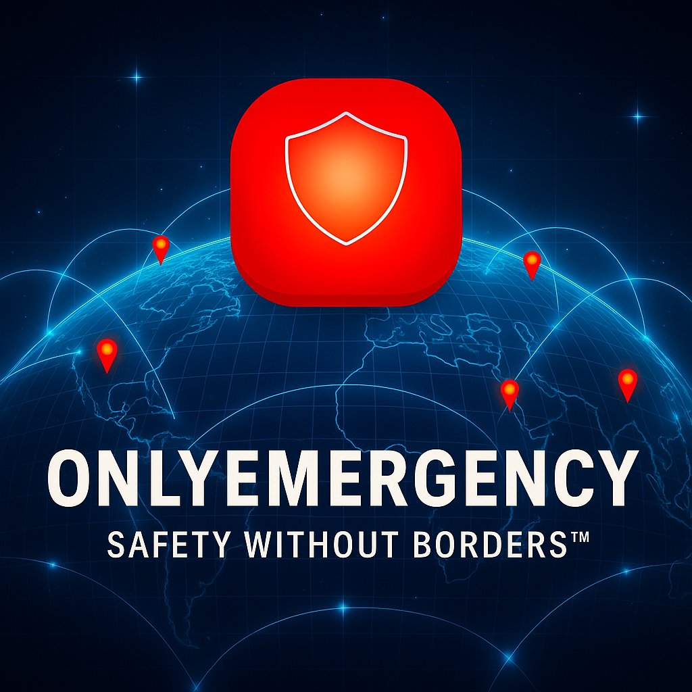

# 🚨 ONLYEMERGENCY – Safety Without Borders™  

  

 
 
 
 
  

  

---

## 🌍 Vision – Safety Without Borders™  

Human life is the **most valuable asset** on Earth, yet technology has advanced faster for **finance, mobility, and the internet** than for **global safety**.  
- The **Internet** connected the world.  
- **Cryptocurrency & Blockchain** built trust without borders.  
- **Uber** redefined instant mobility.  
- **Google Maps** brought location intelligence to everyone.  

But **safety** — the foundation of peace and human dignity — has been left behind.  

**ONLYEMERGENCY** changes this. Powered by the **Global Safety Live Board (GSLB™)**, it sets a **new global standard for safety, security, and peace**.  

We aim to collaborate with:  
- **United Nations (UN)**  
- **World Health Organization (WHO)**  
- **Interpol**  
- **Red Cross & NGOs**  
- **Governments worldwide**  

✨ Our mission: **Make Safety Without Borders™ a universal human right.**  

---

## 🔑 Core Features  

- 🆘 **One-Tap SOS Alerts** – notify family, responders & authorities instantly  
- 📍 **Emergency Locator** – find nearest **hospitals, police, fire stations, shelters, and military bases**  
- 👨‍👩‍👧 **Family & Community Alerts** – instantly notify trusted contacts nearby  
- 🔴 **Trigger Awareness (GSLB™)** – live global map pings with tracking until rescue  
- 🤖 **AI Crisis Guidance** – first aid, fire safety & mental health advice in real time  
- 📡 **Offline Mode** – works even without internet connectivity  
- 🔗 **Decentralized Safety Network** – blockchain-backed trust & transparency  

---

## ⭐ Groundbreaking Innovation – GSLB™ (Global Safety Live Board)  

**The Star Boy of ONLYEMERGENCY.**  

The **Global Safety Live Board (GSLB™)** is a **real-time safety dashboard**, designed like a **stock/crypto live board**, but for **emergency events**.  

How it works:  
1. **Incident Trigger** → Robbery, accident, fire, disaster.  
2. **Automatic Location Capture** → GSLB™ picks user’s live coordinates.  
3. **Agency Notification** → Nearest police, hospital, fire or shelter instantly alerted.  
4. **Continuous Tracking** → Board updates in real time with pins, lines, and stars until user confirms “Safe.”  
5. **Global Visibility** → Safety data becomes part of the **world map grid**, glowing like constellations of protection.  

✨ Why this matters:  
- Saves **millions of lives annually** by reducing response time.  
- Cuts **billions in government costs** by preventing insecurity and disasters.  
- Creates a **new universal safety protocol**.  

---

## ⚡ WA-EBS™ – World’s First Accountable Emergency Broadcast System  

**WA-EBS™ – Global Trust. Local Action.**  

Steps:  
1. **Select live scene Incident** (Robbery, Accident, Fire, Disaster etc)  
2. **Trigger Awareness** (GSLB™ board activates with tracking)  
3. **Global Broadcast** (alerts sent to agencies, family, and communities)  
4. **Turn Off** (requires **Face ID** + reason → accountability ensured)  

> ✨ From innovation to international safety standard.  

---

## 📜 Global Standards & Protocols  

ONLYEMERGENCY is designed to align with **international safety standards**:  

- **ISO 20022** – Safety Management Systems for emergency preparedness and risk control.  
- **UN Sustainable Development Goals (SDGs)** – Peace, Justice, and Strong Institutions.  
- **Pi Blockchain Security Frameworks** – decentralized trust protocols.  

By adopting **ISO 20022 standards**, ONLYEMERGENCY ensures **global interoperability**, allowing governments, NGOs, and emergency services to adopt this innovation as a **recognized safety protocol**.  

---

## 👨‍💻 Coding & Implementation Section  

First README in history to embed a **coding section as part of its innovation roadmap**.  

```python
# GSLB™ Real-Time Tracking Prototype (Python)
class GSLB:
    def __init__(self, user_location):
        self.user_location = user_location
        self.is_active = False

    def trigger_awareness(self, incident_type):
        self.is_active = True
        print(f"🚨 {incident_type} reported at {self.user_location}")
        print("Location sent to nearest police, hospital, fire & military units.")
        print("Tracking activated until user confirms safe.")

    def confirm_safe(self):
        self.is_active = False
        print("✅ User confirmed safe. Tracking stopped.")

# Example
gslb = GSLB("Lagos, Nigeria")
gslb.trigger_awareness("Robbery")  # simulate event
# → sends location + activates GSLB grid tracking

This section demonstrates how real-time triggers, continuous tracking, and agency alerts will function inside ONLYEMERGENCY.


---

🏆 Guinness World Record Recognition

ONLYEMERGENCY is positioned for multiple world-firsts:

1. First README & Whitepaper in history with embedded coding section


2. First Global Safety Protocol (GSLB™)


3. First app aligned with ISO 200 standards for global safety


4. First platform with 50+ integrated safety features


5. First decentralized safety ecosystem to align with UN SDGs on peace & security


✨ Guinness World Records categories: Innovation, Humanitarian Tech, Safety Protocols, and Security Standards.


---

🗺️ Roadmap (2025–2027)


Q1–Q4 2025 → Core dev, GSLB™ prototype, Pi Testnet launch.

Q1–Q2 2026 → Partnerships with agencies, AI integration, multilingual rollout.

Q3–Q4 2026 → Global scaling, ISO 200 certification, Guinness record submissions.

Q1–Q4 2027 → Full adoption push, UN/WHO/Interpol recognition, public standardization.


---

📈 Global Impact

🌍 Governments → billions saved from reduced insecurity & disaster response.

🏥 Hospitals & NGOs → faster aid and triage.

👨‍👩‍👧 Families → instant protection across borders.

🕊️ Humanity → a universal safety net, just like the internet.


---

👤 Founder’s Note

“I am Kelubia Hope, Founder & Product Lead of ONLYEMERGENCY.

When the world celebrates breakthroughs in finance, crypto, and AI, I ask:
👉 Why not in safety?

GSLB™ is my answer — a new protocol for humanity, where no life is left unprotected.

This project is more than technology. It is a call to action for governments, organizations, and global citizens to unite for safety without borders.

History will remember this as the moment safety became a global standard, not a privilege.

— Kelubia Hope 🚨”


---

🤝 Call to Action

We invite investors, global agencies, and innovators:

Support adoption of GSLB™.

Endorse Safety Without Borders™ as a universal right.

Help us build the world’s first global safety infrastructure.


📧 onlyemergency247@gmail.com
🌐 GitHub Repository


---

📜 License

This project is licensed under the MIT License.
You are free to use, modify, and distribute it under the same terms.


---

📜 Attribution & Trademark Notice

© 2025 Kelubia Hope — OnlyEmergency 🚨

The OnlyEmergency name, logo, and tagline “Safety Without Borders™” and GSLB™ are trademarks of Kelubia Hope.

⚡ Safety Without Borders. Powered by Decentralization.
